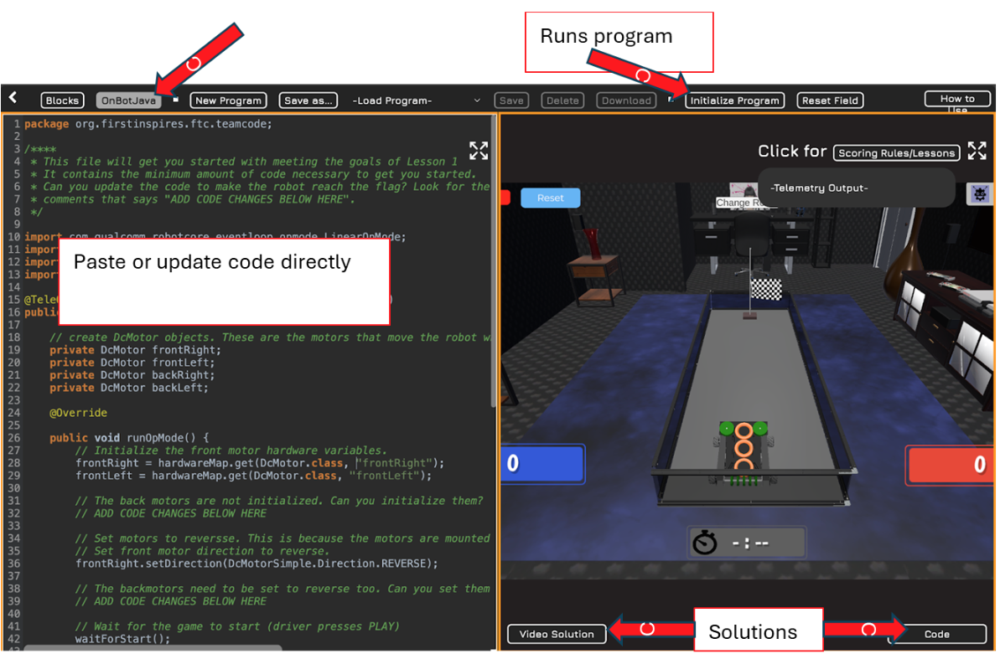

# Overview

This page references a series of simulation levels designed and presented by the VRS to teach and test robotics programming skills. I’ve only checked out some of their lessons, but their simulator has some cool features to explore.

VRS Robot Simulator Beginner Lessons Website: <https://www.vrobotsim.online/levelselector.html>

## Recommended Videos Before You Start

- [Installing Android Studio for FTC Projects](https://www.youtube.com/watch?v=_ZIYtNadJBo&list=PLi_pL-OkfRBp4E0PaHXd5nzDY9xrC9k3J&index=6) -
The VRS Simulator allows the student to modify code directly in their simulator. However, the online editor doesn't seem to have type hints (auto-complete suggestions) that many programmers find helpful. Because of this, I highly recommend installing Android Studio.
- [Learn Java for Robotics](https://www.youtube.com/watch?v=F24X8Ut83os&list=PLi_pL-OkfRBp4E0PaHXd5nzDY9xrC9k3J&index=5) - This is a good primer for students to understand some of the basic constructs and features of Java programming in the context of FTC Robotics. Students won't have access to a real controller or bot, however they can still practice the code exercises. And if they want to test their code, they could copy and paste their code directly into one of the VRS Simulator lessons to see how it behaves.

## 📚 Level Breakdown

- **Level 1**: Drive forward and raise a flag.
- **Level 2**: Drive, turn, strafe; introduces encoders and variables.
- **Level 3**: Navigate turns and practice strafing.
- **Level 4**: Drive forward, shoot, and reload rings.
- **Level 5**: Shoot red and blue tubes.
- **Level 6**: Drive forward and stop on a line using a color sensor.

## Simulator Lesson Code

The simulator lesson code directly from the VRS simulator isn’t always well formatted or easy to get to. In addition, the code it starts with isn’t helpful. Because of this, we are in the process of copying VRS Simulator solutions code to this repository, as well as creating a code lesson template for the students start with.  

To get to the lesson code templates and solutions from the Indecisive Devices PreSeasonSandbox GitHub code repository, go to <https://github.com/IndecisiveDevices/PreSeasonSandbox/tree/main/TeamCode/src/main/java/org/firstinspires/ftc/teamcode/SimulatorLessons>

If your student is making good progress and I don’t have the starting template and solution in our GitHub repository, you can get to the VRS provided solution by clicking the “Code” button at the bottom right of the simulator screen (see bottom most screenshot for example).

# 🚀 VRS Simulator Guide

Follow these steps to complete Level 1 using OnBot Java and the Indecisive Devices starter code. The instructions here describe steps for Level 1, however students should follow the same basic steps for the remaining lessons.

---

## 🧭 Step-by-Step Instructions

### 1. Open the Simulator

&nbsp;&nbsp;&nbsp;&nbsp;
Go to [VRS Simulator Level 1](https://www.vrobotsim.online/level1.html).

### 2. Launch OnBot Java

&nbsp;&nbsp;&nbsp;&nbsp;
Click the **On Bot Java** button at the top of the simulator window to open the code editor.

### 3. Paste Starter Code

&nbsp;&nbsp;&nbsp;&nbsp;
In the code window, paste the starter code from the [Lesson1 folder in the Indecisive Devices GitHub repository](https://github.com/IndecisiveDevices/PreSeasonSandbox/tree/main/TeamCode/src/main/java/org/firstinspires/ftc/teamcode/SimulatorLessons/Lesson1).

### 4. Update the Code

&nbsp;&nbsp;&nbsp;&nbsp;
    Make the following updates:
&nbsp;&nbsp;&nbsp;&nbsp;

- Initialize the back motors using the hardware map.
- Set the direction of the back motors.
- Set power to all four motors so the robot drives forward.
- Bonus challenge: Can you make the robot spin in a circle for 4 seconds after reaching the flag?

&nbsp;&nbsp;&nbsp;&nbsp;
*Hint*: Look for comments like: `// ADD CODE CHANGES BELOW HERE`

### 5. ▶️ Run Your Program

- Click **Initialize Program** in the simulator.
- Once it changes to **Run Program**, click that too.
- Your robot should drive forward and raise the flag.

